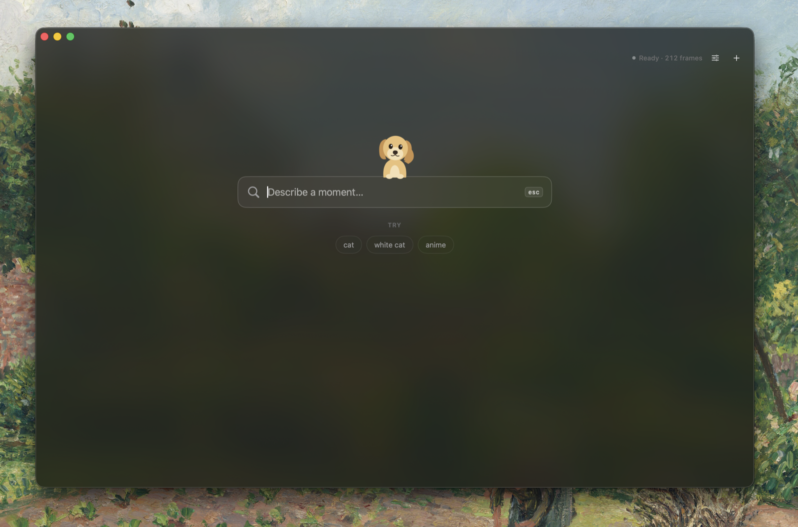
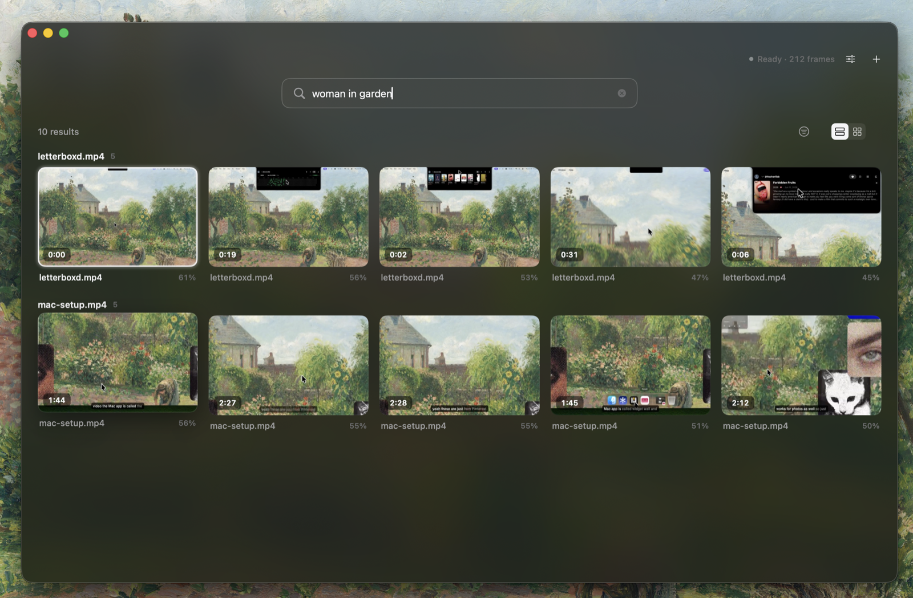
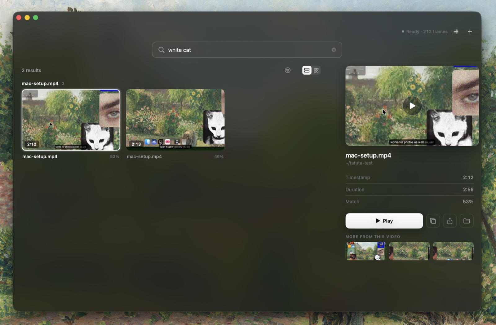
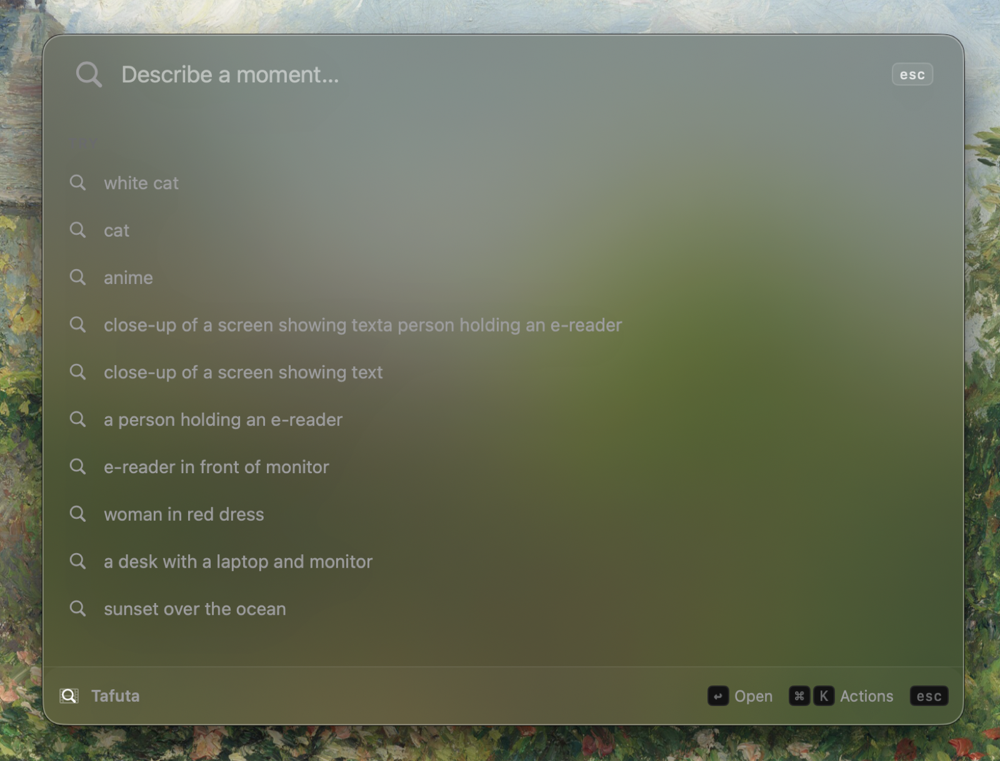

<div align="center">


# Tafuta

**Find the moment, not just the file.**

Semantic video search for macOS. Fully on device.

[Download](https://github.com/IvanKuria/tafuta/releases/latest) ·
[Building from source](#building-from-source) ·
[Architecture](docs/PLAN.md) ·
[License](LICENSE)

</div>

---

Tafuta (Kiswahili for "find") lets you search inside your own videos with plain language.
Describe a moment, for example "woman wearing a white blouse in a green meadow", and Tafuta
jumps straight to that second of the clip even if the file is named `IMG_0423.mov`.

It is built for people with large video libraries (creators, filmmakers, anyone with a camera
roll out of control) where filenames and dates are useless for finding that one shot.

## Screenshots

<div align="center">



<br /><br />



<br /><br />



<br /><br />



</div>

## Why it is different

- **It searches what is on screen, not the filename.** Powered by on device CLIP style
  embeddings (Apple's MobileCLIP via Core ML), Tafuta understands the content of each frame.
- **Everything stays on your Mac.** All indexing and search run locally on the Apple Neural
  Engine. No uploads, no account, no telemetry. Your video never leaves your device.
- **Jumps to the exact moment.** Results are timestamps inside videos, not just a list of
  files. Click a result and playback starts right there.
- **Fast, minimal, native.** A polished SwiftUI interface with a main window and a global
  hotkey launcher, in light and dark modes.

## How it works

0. On first launch, Tafuta downloads the MobileCLIP models (about 108MB) once and caches them
   locally. After that everything runs offline.
1. Point Tafuta at a folder of videos.
2. It samples frames (roughly one per second, with scene change deduplication) and encodes
   each frame into a 512 dimension vector using MobileCLIP on the Neural Engine.
3. Vectors and metadata are stored locally on your internal disk, so search keeps working even
   when an external drive is unplugged.
4. When you type a query, Tafuta encodes the text into the same vector space and runs a nearest
   neighbor search to rank matching moments.

## Install

Download the latest notarized build from the
[Releases page](https://github.com/IvanKuria/tafuta/releases/latest), open the disk image, and
drag Tafuta to your Applications folder. The build is signed with a Developer ID and notarized
by Apple, so it launches without Gatekeeper warnings.

Requires macOS 14 or later on Apple Silicon.

## Building from source

Requires macOS on Apple Silicon, Xcode, and XcodeGen (`brew install xcodegen`).

```sh
cd app && xcodegen generate
xcodebuild -scheme Tafuta -configuration Debug build
open Tafuta.xcodeproj            # or open in Xcode and Run
```

The MobileCLIP models are downloaded automatically on first launch, so no separate fetch step is
needed. If you prefer to pre-download them (for offline builds), run `./tools/fetch_models.sh`.

Then click "Add Folder" and pick a folder of videos. For development you can set
`TAFUTA_INDEX_DIR=/path/to/videos` to auto index a folder on launch.

## Roadmap

- **v1**: local semantic video search, folder indexing, exact moment results, hover scrub
  preview, in app playback, export and drag clips, find similar moments.
- **Later**: Whisper audio search, image query mode, saved smart folders, and an optional
  cloud tier for accelerated indexing of very large libraries.

## Project model

Tafuta is open source under GPLv3, and the core app stays open. An optional Pro or cloud tier
may be offered later (open core) for power features such as on device audio search and cloud
accelerated indexing. The local search experience is and remains free.

## Contributing

Contributions are welcome. See [CONTRIBUTING.md](CONTRIBUTING.md) for the development setup,
project structure, architecture overview, and pull request guidelines. In short: build from
source as described above, keep changes focused, match the existing code style, and open an
issue to discuss substantial changes first.

## License

[GPL-3.0](LICENSE). Copyright 2026 Ivan Kuria.
